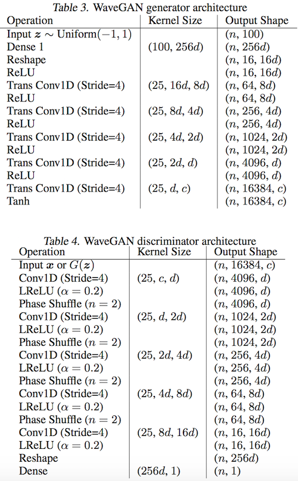
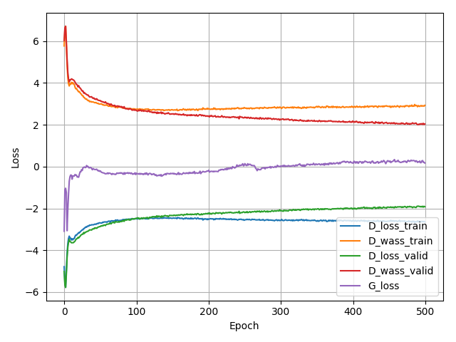

# WaveGAN-pytorch
This repo is based on [chrisdonahue's](https://github.com/chrisdonahue/wavegan#build-datasets) and [jtcramer's](https://github.com/jtcramer/wavegan) implementation of [Synthesizing Audio with Generative Adversarial Networks(Chris Donahue, Feb 2018)](https://arxiv.org/abs/1802.04208).

.

## Dataset
You can find these datasets at [this URL](https://github.com/chrisdonahue/wavegan#build-datasets).
* `sc09Wav`: utterances of number "0"-"9". (20,000+ pieces each 1 second, 400MB)
* `Piano`: piano waves. (100MB)

Befor running, make sure you have the `sc09Wav` dataset, and put that dataset under your current filepath.

## Installation
```
sudo apt-get install libav-tools
```

## Run
For SC09 generation task:
```
nsml run -v -d sc09Wav -e train.py
```

### Training time
* For `SC09Wav` dataset, 4 X Tesla P40 takes nearly 2 days to get reasonable result.
* For `piano` piano dataset, 2 X Tesla P40 takes 3-6 hours to get reasonable result.
* Decrease the `BATCH_SIZE` from 64 to 16 can acquire faster gradient descent but longer per-epoch time on multiple-GPU.

## Architecture


## Results
Generated "0-9":

https://soundcloud.com/mazzzystar/sets/dcgan-sc09

Generated piano:

https://soundcloud.com/mazzzystar/sets/wavegan-piano

Loss:



## TODO
* [ ] Add some evaluation experiments, eg. inception score.

## Contact & thanks

